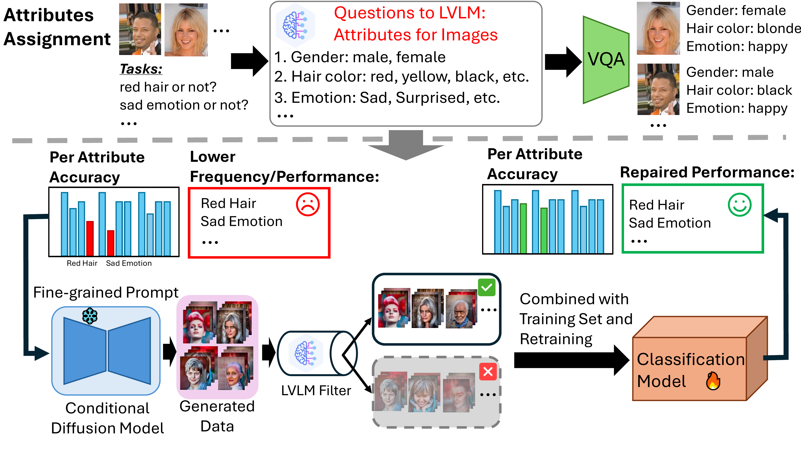

# SafeFix: Targeted Model Repair via Controlled Image Generation

**SafeFix** is a data-centric pipeline for automated model repair in vision tasks. It identifies rare-case failure slices in classification models and generates targeted, attribute-preserving synthetic data to fine-tune models, improving performance on underrepresented subpopulations without degrading overall accuracy.


## ✨ Key Features

- **Failure Slice Diagnosis**  
  Uses HiBug-style attribute-based failure detection to pinpoint rare-case bugs characterized by low accuracy and low training support.

- **Controlled Image Generation**  
  Leverages Stable Diffusion with ControlNet conditioning on soft HED boundaries to generate visually faithful images that target specific attribute combinations.

- **Semantic Filtering via LVLM**  
  Applies a large vision–language model (e.g., Qwen-2.5-VL) to verify that each generated image correctly reflects the intended attributes and original labels.

- **Automated Training Pipeline**  
  Augments the original training set with validated synthetic samples and retrains the model, yielding consistent accuracy improvements on rare-case slices.


## 🛠️ Installation

1. Create the Conda environment:
   ```bash
   conda env create -f SafeFix-env.yml
   ```
2. Activate the environment:
   ```bash
   conda activate SafeFix
   ```


## 🚀 Usage

1. Get attribute assignment:
   ```bash
   python blip.py
   ```
2. Get related indices for selected attributes:
   ```bash
   python map.py
   ```
3. Generate ControlNet images for `redhair_brownskin_sademotion`:
   ```bash
   python controlnet.py --attributes redhair_brownskin_sademotion
   ```
4. Filter generated samples for `redhair_brownskin_sademotion`:
   ```bash
   python filter.py \
     --max_memory 23 \
     --attributes redhair_brownskin_sademotion
   ```
5. Predict and evaluate on CelebA with ResNet:
   ```bash
   python predict.py \
     --dataset celeba \
     --model resnet \
     --num_added_img 1000 \
     --num_epochs 20
   ```


## 📝 Citation

If you find our paper and code useful in your research, please consider giving a star ⭐ and citation 📝.

```bibtex
@misc{xu2025safefix,
   title={SafeFix: Targeted Model Repair via Controlled Image Generation}, 
   author={Ouyang Xu and Baoming Zhang and Ruiyu Mao and Yunhui Guo},
   year={2025},
   eprint={2508.08701},
   archivePrefix={arXiv},
   primaryClass={cs.CV},
   url={https://arxiv.org/abs/2508.08701}, 
}
```


## 📄 License

This project is licensed under the MIT License. See the [LICENSE](LICENSE) file for details.
